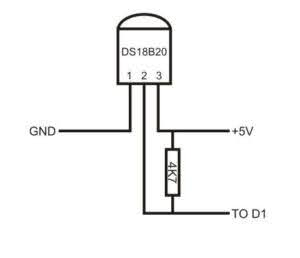
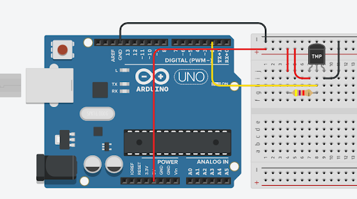
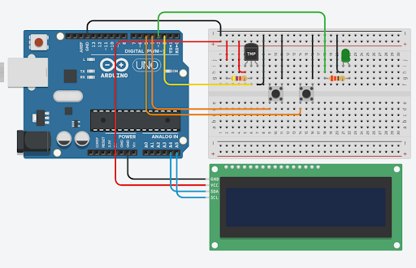

# Работа с датчиком температуры DS12B20



##Основные характеристики:

* Диапазон: -55.. 125 °C
* Точность: 0.5 °C
* Разрешение: 9.. 12 бит (0.48.. 0.06 °C)
* Питание: 3-5.5V
* Период выдачи результата:
* 750 мс при точности 12 бит
* 94 мс при точности 9 бит
* Интерфейс связи: 1-Wire (OneWire)


# Схема подключения и программа



Установите библиотеку DallasTemperature (если не установлена)
и откройте код Simple из ее примеров.

# Мини-проект Вывод показаний на LCD и задание порога температуры



```c
#include <OneWire.h>
#include <DallasTemperature.h>
#include <GyverOLED.h>
#define ONE_WIRE_BUS 2

OneWire oneWire(ONE_WIRE_BUS);

DallasTemperature sensors(&oneWire);

GyverOLED<SSD1306_128x64,

OLED_BUFFER> oled;

float tempK=24;

uint32_t timerButt = 0; 

void draw(float temp) {
  oled.clear();
  oled.setScale(2);
  oled.setCursor(1, 0);  
  oled.print("Температура: ");
  oled.print(temp);
  oled.setCursor(1, 4);  
  oled.print("Пороговая: ");
  oled.print(tempK);
  oled.update(); 
}

void setup() {
  pinMode(3, OUTPUT);
  pinMode(4, INPUT_PULLUP);
  pinMode(5, INPUT_PULLUP);
  oled.init();
  sensors.begin();  
}

void loop() { 
  sensors.requestTemperatures();   
  float tempC = sensors.getTempCByIndex(0);
  draw(tempC);

  if (tempC < tempK-0.5 || tempC > tempK+0.5){
    digitalWrite(3, 1);  
  }
  else{
   digitalWrite(3, 0);  
  }

  if(!digitalRead(4) && millis()-timerButt >=100){
    tempK = tempK-0.5;
    timerButt = millis();  
  }

  if(!digitalRead(5) && millis()-timerButt >=100){
    tempK = tempK+0.5;
    timerButt = millis();  
  }  
}
```

# EEPROM

Сохранение задаваемой пороговой температуры в долгосрочной памяти микроконтроллера.

Примечание: строку `//EEPROM.put(0, tempK);` следует раскомментировать при первом запуске, потом закомментировать и загрузить еще раз.

```c
#include <OneWire.h>
#include <DallasTemperature.h>
#include <GyverOLED.h>
#include <EEPROM.h>

#define ONE_WIRE_BUS 2

OneWire oneWire(ONE_WIRE_BUS);
DallasTemperature sensors(&oneWire);
GyverOLED<SSD1306_128x64, OLED_BUFFER> oled;

float tempK=24;
uint32_t timerButt = 0; 

void draw(float temp) {
  oled.clear();
  oled.setScale(2);
  oled.setCursor(1, 0);  
  oled.println("Температура: ");
  oled.print(temp);
  oled.setCursor(1, 4);  
  oled.println("Пороговая: ");
  oled.print(tempK);
  oled.update();
}

void setup()
{
  pinMode(3, OUTPUT);
  pinMode(4, INPUT_PULLUP);
  pinMode(5, INPUT_PULLUP);
  //EEPROM.put(0, tempK);
  EEPROM.get(0, tempK);
  oled.init();
  sensors.begin();
}

void loop() { 
  sensors.requestTemperatures();   
  float tempC = sensors.getTempCByIndex(0);
  draw(tempC);

  if (tempC < tempK-0.5 || tempC > tempK+0.5){
    digitalWrite(3, 1);
  } else{digitalWrite(3, 0);}

  if(!digitalRead(4) && millis() - timerButt >=100){
    tempK = tempK-0.5;
    EEPROM.put(0, tempK);
    timerButt = millis();
  }

  if(!digitalRead(5) && millis() - timerButt >=100){
    tempK = tempK+0.5;
    EEPROM.put(0, tempK);
    timerButt = millis();
  }
}

```

