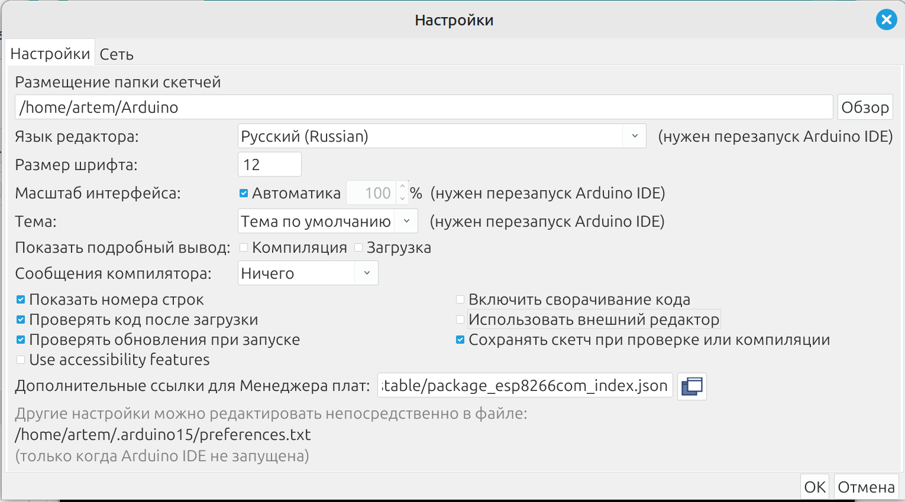
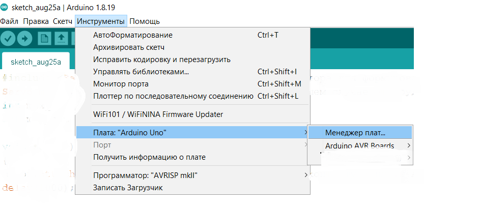
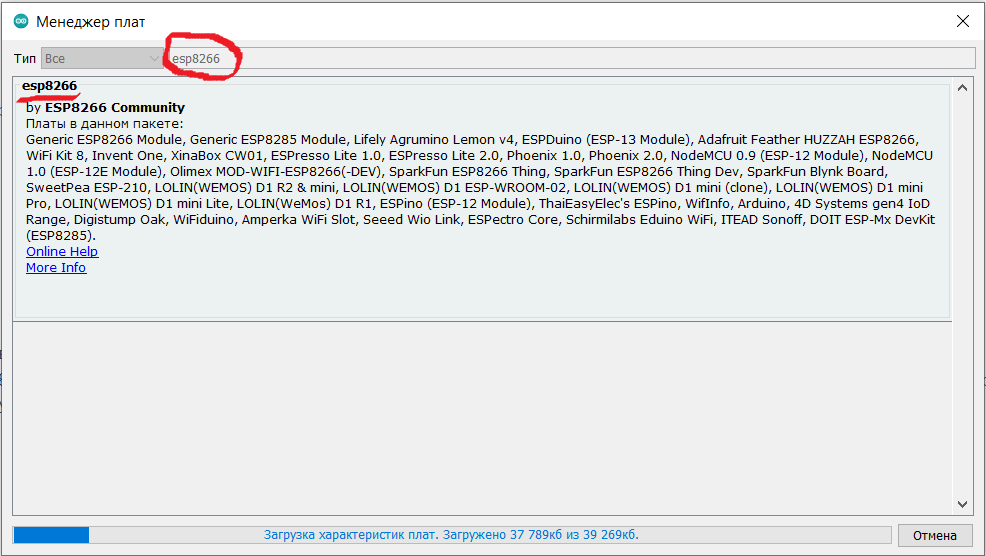
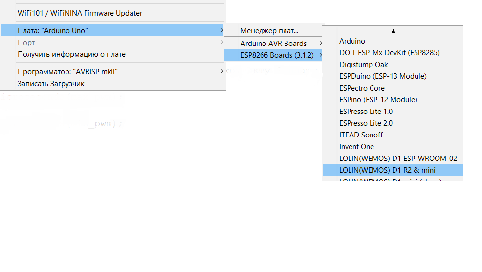
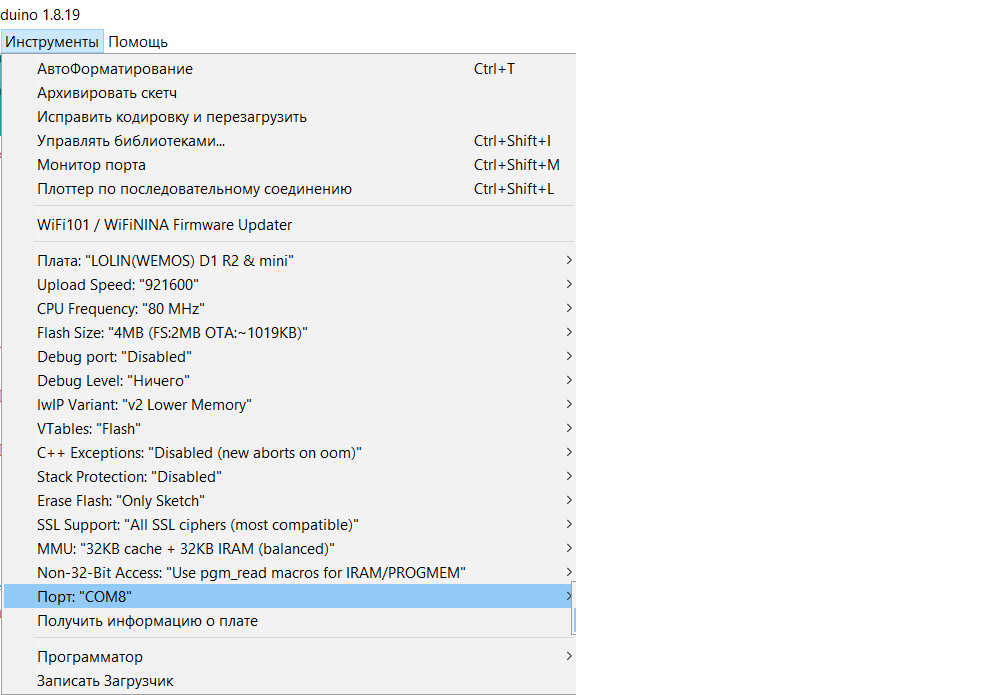

# Установка менеджера плат
Поищите “установка WEMOS гайвер” для более детальной помощи.

Откройте Настройки. В поле дополнительные устройства вставьте https://arduino.esp8266.com/stable/package_esp8266com_index.json и нажмите ок.

Откройке Инcтрументы, Там где выбор платы, выберите Менеджер плат. 

В его строке поиска введите esp8266 и установите найденный пакет. 

Снова откройке Инcтрументы, Там где выбор платы, должно появиться подменю с “ESP8266 Boards”. 

Выбираем там LOLIN (WEMOS) D1 R2 & mini

Больше ничего не меняем в настройках платы, устанавливаем порт.

# Установка дополнительных библиотек для проекта
* Fastbot от Гайвера
* Adafruit Sensors от Adafruit
 * зависимость Adafruit Unified Sensors

# Код для датчика влажности и температуры.

[wemos_dht.c](wemos_dht.c)

# Инструкция по настройке бота
Найдите BotFather (с иконкой крестного отца)

Задайте команду /newbot

Задайте название бота, например “Artems temp and hum bot”

Задайте имя бота, например (artems_temp_hum_bot)

Телеграм выдаст вам токен - надо его скопировать эту строку, например, на флешку и перенести на комп, иначе будет тяжело вводить символы один за другим.

# Код для работы с ботом.

[wemos_dht_bot.c](wemos_dht_bot.c)
